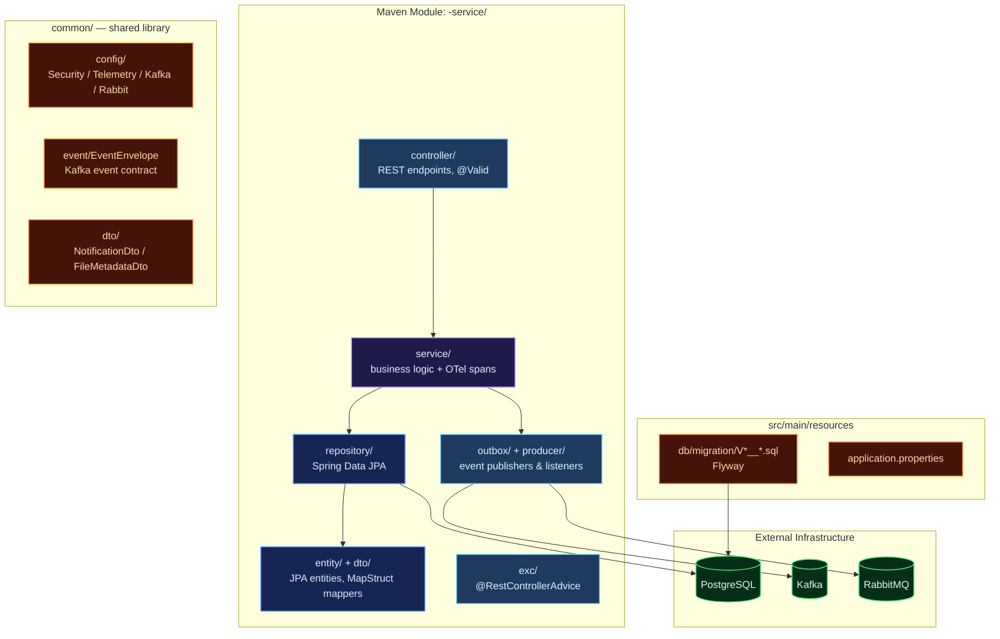
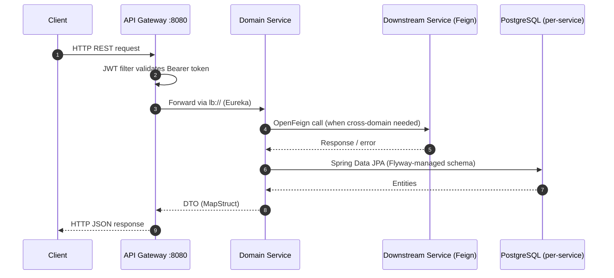
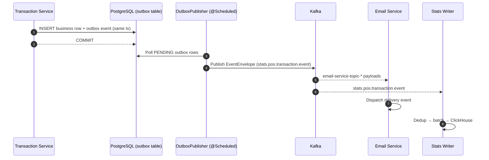
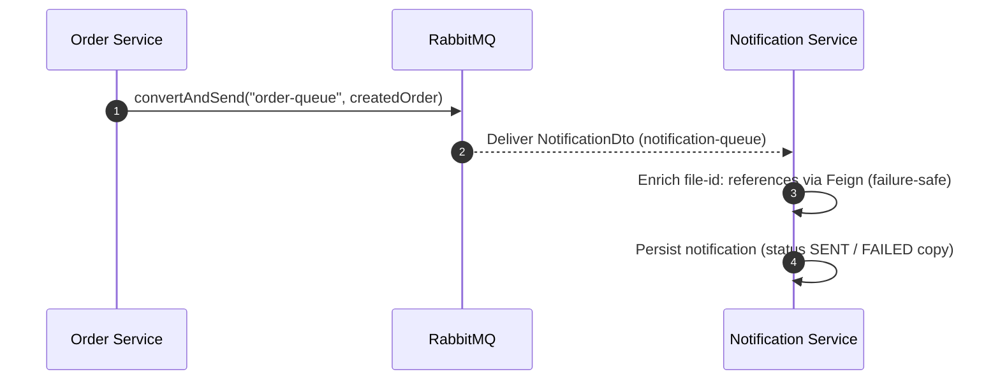

# Distributed Microservices — Point of Sale Platform (Spring Boot Cloud)

A production-grade, fully observable **microservices point of sale (POS) backend** built in **Java 21** on **Spring Boot 3.5.3** and **Spring Cloud 2025.0.0**. Designed around domain-driven service boundaries, each retail and identity business domain — Users, Roles, Auth, Cashiers, Merchants, Categories, Products, Orders, Order Items, Transactions — lives in its own self-contained Maven module, running as an **independent JVM process** with its own REST API, PostgreSQL database, and Flyway migrations, achieving true service-level isolation and independent deployability.

Services register with **Netflix Eureka** for service discovery, communicate synchronously via **OpenFeign** REST clients, and asynchronously through **Apache Kafka** (transactional outbox pattern) and **RabbitMQ** (order & notification queues). A **Spring Cloud Gateway** (WebFlux) acts as the unified reactive entry point with JWT authentication at the edge. A dedicated **ClickHouse analytics layer** (stats-writer, stats-reader, stats-backfill) provides business intelligence decoupled from the transactional store.

The platform ships with a **comprehensive observability suite** (OpenTelemetry Collector, Prometheus, Grafana, Loki, Jaeger) and full Docker Compose orchestration.

---

## Key Features

| Domain | Capabilities |
| :--- | :--- |
| **Auth & Users** | Registration and login with stateless JWT tokens (jjwt), BCrypt password hashing, Feign-backed user lookup for authentication. |
| **Roles & RBAC** | Role entities with composite `user_roles` assignments (assign/remove/lookup by user), JPQL role-name projections. |
| **Merchants** | Merchant onboarding with auto-generated merchant numbers & API keys, document management, soft-delete columns with hard-delete application semantics. |
| **Cashiers** | Staff management per merchant with soft-delete lifecycle (`deleted_at`), merchant-scoped lookups. |
| **Categories** | Product taxonomy with auto-derived slugs (`@PrePersist`) and slug deduplication. |
| **Products** | Inventory CRUD with image-metadata validation via Feign and stock decrease endpoint consumed by order checkout. |
| **Orders & Items** | JWT-identity checkout flow (SecurityContext → Feign user lookup → Feign stock decrease), RabbitMQ order publication, and order-item decomposition. |
| **Transactions** | Central financial ledger with **idempotency-key deduplication**, PPN 11% tax computation (`calculateTotalWithTax`), and a Kafka outbox publisher for `transaction.completed` events. |
| **Notification & File Storage** | RabbitMQ-driven notification consumer with file metadata enrichment (failure-safe), and a file-storage service consumed over Feign by product & notification. |
| **Email Worker** | Kafka-driven asynchronous worker logging delivery events (receipts, notifications, merchant notices). |
| **ClickHouse Analytics** | Three-component pipeline: stats-writer (Kafka→ClickHouse), stats-reader (REST→Redis cache), stats-backfill (PostgreSQL→outbox→Kafka→ClickHouse). |
| **Transactional Outbox** | Events written to DB within the business transaction, relayed to Kafka by a scheduled OutboxPublisher — no event loss during Kafka outages. |
| **Observability** | OpenTelemetry traces/metrics to the OTel Collector, Prometheus metrics, Grafana dashboards, Loki log aggregation, Jaeger tracing. |
| **Deployment** | Docker Compose orchestration with 12 per-service PostgreSQL databases, RabbitMQ, Kafka, Redis, ClickHouse, and the observability stack. |

---

## Architecture Overview

The platform implements a **Spring Cloud microservices** architecture. Every business service is a standalone Spring Boot application with its own port, database, and Flyway migration set. Services register with **Eureka** and resolve each other through load-balanced calls; the **Spring Cloud Gateway** is the single edge router, applying JWT validation per route before forwarding.

### Core Architecture Principles

- **Service-Level Isolation**: One JVM process, one database, one migration chain per business domain. No shared databases.
- **Layered Modules**: `Controller → Service → Repository` with MapStruct DTO mappers; `@RestControllerAdvice` error handling where present.
- **Service Discovery**: Netflix Eureka — services address each other by logical name (`lb://service-name`).
- **Synchronous Communication**: OpenFeign (stock decrease, user lookups, file metadata enrichment).
- **Event-Driven Resilience**: Kafka transactional outbox (transaction domain) plus RabbitMQ queues (order publication, notifications).
- **OTel Telemetry**: Shared or copied `TelemetryConfig` bootstraps the OTel SDK — spans, counters, histograms (`requests_total`, `requests_duration_seconds`, `failure_total`) per service operation, exported over OTLP.

```mermaid
graph TB
    classDef client fill:#0f172a,stroke:#38bdf8,color:#e0f2fe,stroke-width:2px,font-weight:bold
    classDef gateway fill:#1e293b,stroke:#22d3ee,color:#cffafe,stroke-width:2px
    classDef domain fill:#1e1b4b,stroke:#818cf8,color:#e0e7ff,stroke-width:1.5px
    classDef infra fill:#172554,stroke:#60a5fa,color:#dbeafe,stroke-width:1.5px
    classDef obs fill:#052e16,stroke:#4ade80,color:#dcfce7,stroke-width:1.5px
    classDef event fill:#431407,stroke:#fb923c,color:#fed7aa,stroke-width:1.5px

    Client["Client Applications<br/>(Web / Mobile / API)"]:::client

    subgraph Edge["Edge Layer"]
        direction LR
        GW["Spring Cloud Gateway<br/>WebFlux Router :8080"]:::gateway
        JWT["JWT Auth Filter<br/>per route"]:::gateway
        EUREKA["Eureka Server<br/>Service Registry :8761"]:::gateway
    end

    Client -->|HTTP REST| GW
    GW -.->|register / resolve| EUREKA

    subgraph BusinessServices["Business Domain Services (Spring Boot)"]
        direction TB

        subgraph IdentityDomain["Identity & Access"]
            AUTH["Auth Service :8085<br/>JWT + Feign to user"]:::domain
            USER["User Service :8084"]:::domain
            ROLE["Role Service :8088<br/>RBAC assignments"]:::domain
        end

        subgraph MerchantDomain["Merchant Management"]
            MERCH["Merchant Service :8089"]:::domain
        end

        subgraph RetailDomain["Retail & Inventory"]
            CASHIER["Cashier Service :8090<br/>soft-delete lifecycle"]:::domain
            CATEGORY["Category Service :8091<br/>slug dedup"]:::domain
            PRODUCT["Product Service :8082<br/>stock + image Feign"]:::domain
        end

        subgraph CheckoutDomain["Checkout & Transactions"]
            ORDER["Order Service :8083<br/>checkout + RabbitMQ"]:::domain
            OI["Order Item Service :8092"]:::domain
            TXN["Transaction Service :8093<br/>idempotency + outbox"]:::domain
        end

        subgraph PlatformServices["Platform Services"]
            NOTIF["Notification Service :8086<br/>RabbitMQ consumer"]:::domain
            FS["File Storage :8087<br/>file metadata"]:::domain
        end
    end

    GW -->|REST| AUTH
    GW -->|REST| USER
    GW -->|REST| ROLE
    GW -->|REST| MERCH
    GW -->|REST| CASHIER
    GW -->|REST| CATEGORY
    GW -->|REST| PRODUCT
    GW -->|REST| ORDER
    GW -->|REST| TXN
    GW -->|REST| NOTIF
    GW -->|REST| FS

    subgraph Infrastructure["Infrastructure Layer"]
        direction LR
        PG[("PostgreSQL<br/>12 per-service DBs")]:::infra
        RABBIT[("RabbitMQ<br/>:5672")]:::infra
        KAFKA[("Kafka<br/>Event Bus :9092")]:::infra
        REDIS[("Redis<br/>:6379")]:::infra
        CLICKHOUSE[("ClickHouse<br/>Analytics :8123")]:::infra
    end

    AUTH -->|JPA| PG
    USER -->|JPA| PG
    MERCH -->|JPA| PG
    CASHIER -->|JPA| PG
    PRODUCT -->|JPA| PG
    ORDER -->|JPA| PG
    TXN -->|JPA| PG

    ORDER -->|publish order-queue| RABBIT
    RABBIT -->|consume| NOTIF
    NOTIF -->|Feign| FS

    TXN -.->|outbox| KAFKA
    KAFKA -->|consume| EMAIL_W

    subgraph EventConsumers["Event-Driven Consumers"]
        EMAIL_W["Email Service :8094<br/>3 Kafka listeners"]:::event
        STATS_W["Stats Writer :8095<br/>batch to ClickHouse"]:::event
    end

    STATS_W --> CLICKHOUSE
    STATS_R["Stats Reader :8096<br/>Redis-cached queries"]:::event
    STATS_R --> CLICKHOUSE
    STATS_R --> REDIS

    subgraph Observability["Observability Stack"]
        direction LR
        OTEL["OTel Collector"]:::obs
        PROM["Prometheus"]:::obs
        LOKI["Loki"]:::obs
        JAEGER["Jaeger"]:::obs
        GRAFANA["Grafana"]:::obs
    end

    AUTH -.->|OTLP| OTEL
    ORDER -.->|OTLP| OTEL
    TXN -.->|OTLP| OTEL
    GW -.->|OTLP| OTEL
    OTEL -.-> JAEGER
    OTEL -.-> PROM
    LOKI -.-> GRAFANA
    PROM -.-> GRAFANA
```



---

## Service Catalog

**20 Maven modules** — 16 runtime services, 1 shared library, 1 seeder, 2 stats support:

| # | Service | Module | Port | Responsibility |
| :- | :------ | :----- | :--- | :------------- |
| 1 | Eureka Server | `eureka-server` | 8761 | Service registry |
| 2 | API Gateway | `api-gateway` | 8080 | Spring Cloud Gateway (WebFlux), JWT filter, routing |
| 3 | Common | `common` | — | Shared library: DTOs, EventEnvelope, Kafka/Rabbit/Security/Telemetry config, seeder contracts |
| 4 | Auth | `auth-service` | 8085 | Login/register, JWT issuing (jjwt), Feign to user-service |
| 5 | User | `user-service` | 8084 | User CRUD, `findByUsername` for auth |
| 6 | Role | `role-service` | 8088 | Roles + composite user-role assignments |
| 7 | Merchant | `merchant-service` | 8089 | Merchant onboarding, documents, auto-generated merchantNo/apiKey |
| 8 | Cashier | `cashier-service` | 8090 | Cashier staff per merchant, soft-delete lifecycle |
| 9 | Category | `category-service` | 8091 | Categories with slug deduplication |
| 10 | Product | `product-service` | 8082 | Product catalog, stock decrease, image validation (Feign) |
| 11 | Order | `order-service` | 8083 | Checkout (JWT identity → Feign user → Feign stock), RabbitMQ publish |
| 12 | Order Item | `order-item-service` | 8092 | Order line items |
| 13 | Transaction | `transaction-service` | 8093 | Financial ledger, idempotency keys, PPN 11%, Kafka outbox |
| 14 | Notification | `notification-service` | 8086 | RabbitMQ consumer, file metadata enrichment, persistence |
| 15 | File Storage | `file-storage-service` | 8087 | File metadata API (consumed via Feign) |
| 16 | Email | `email-service` | 8094 | 3 Kafka listeners (receipt, notification, merchant) |
| 17 | Stats Writer | `stats-writer` | 8095 | Kafka → dedup → batch → ClickHouse |
| 18 | Stats Reader | `stats-reader` | 8096 | Aggregated queries, Redis cache |
| 19 | Stats Backfill | `stats-backfill` | — | One-shot PostgreSQL → outbox → Kafka backfill |
| 20 | Seeder | `seeder` | — | Idempotent data seeding across domains |

---

## Internal Service Architecture



---

## Data & Event Flow

### Synchronous Flow (Gateway → Service → Feign → DB)



### Asynchronous Flow — Kafka (Transactional Outbox)

Transaction mutations write domain events to an `outbox` table inside the same database transaction, then a scheduled `OutboxPublisher` relays them to Kafka — guaranteeing no event loss during broker outages.



### Asynchronous Flow — RabbitMQ (Order Publication & Notifications)



---

## Kafka Event Architecture

Events are published through the **transactional outbox** pattern with `EventEnvelope` (eventId, schemaVersion, eventType, occurredAt, domain, payload). Topic contracts live in `common/src/main/java/com/common/kafka/KafkaCommonConfig.java`.

### Topic Registry

| Category | Topics | Producer → Consumer |
| :------- | :----- | :------------------ |
| **Domain Events** | `stats.pos.order.event`, `stats.pos.transaction.event` | Order/Transaction outbox → Stats Writer |
| **Email Notifications (3)** | `email-service-topic-receipt`, `email-service-topic-notification`, `email-service-topic-merchant` | Order/Transaction/Merchant → Email Service |
| **Notification** | `notification-topic` | Platform services → Notification Service |

All topics are provisioned by `KafkaCommonConfig` (3 partitions, replication factor 1).

### Outbox Publisher

The transaction-service outbox runs a `@Scheduled(fixedDelay = 3000)` publisher: poll `PENDING` rows, send via `KafkaTemplate`, mark `PROCESSED`; failures are retried up to `MAX_ATTEMPTS` before the row is marked `FAILED` with the last error recorded.

---

## RabbitMQ Queues

| Queue | Producer → Consumer | Payload |
| :---- | :------------------ | :------ |
| `order-queue` | Order Service (controller publish) | Order payload for downstream processing |
| `notification-queue` | Platform services | `NotificationDto` (JSON converter) |

---

## ClickHouse Analytics Layer

| Component | Role | Description |
| :-------- | :--- | :---------- |
| **stats-reader** | Query API (port `:8096`) | Aggregated statistical queries against ClickHouse, Redis-cached with configurable TTL. |
| **stats-writer** | Kafka consumer (port `:8095`) | Consumes `stats.pos.*` topics, deduplicates, batches, and flushes to ClickHouse. |
| **stats-backfill** | Batch loader | Reads historical OLTP rows into outbox tables → Kafka → stats-writer → ClickHouse. |

---

## Observability

All services export OpenTelemetry telemetry to the OTel Collector (`otel.exporter.otlp.endpoint`), which fans out to the storage backends. Prometheus scrapes collector-exposed metrics only — no per-service scrape duplication.

| Pillar | Tool | Purpose |
| :--- | :--- | :--- |
| **Tracing** | OpenTelemetry → Jaeger | End-to-end traces across gateway and services (W3C propagation). |
| **Metrics** | Prometheus + Grafana | OTel-collector scrape target, custom counters/histograms per service. |
| **Logging** | Loki + Logback | Centralized structured logs, queryable via LogQL. |

---

## Testing

The platform carries a **468-test suite, all green**, following a consistent three-layer strategy per module:

| Layer | Tooling | Coverage |
| :---- | :------ | :------- |
| **Service unit tests** | JUnit 5 + Mockito + AssertJ, `OpenTelemetry.noop()` | Happy paths, error contracts, outbox captures, soft-delete lifecycle |
| **Controller tests** | Standalone `MockMvc` (no Spring context) | Endpoint mapping, validation 400s, error-path status codes |
| **Repository tests** | `@DataJpaTest` + Testcontainers (`postgres:15-alpine`) + `@ServiceConnection` | Flyway-migrated schema validation, derived queries, constraints |

Existing `@SpringBootTest contextLoads` stubs were replaced by the real suites (they cannot run without the full infrastructure). Testcontainers checks are skipped automatically when Docker is unavailable; the test JVMs pin `docker-java` API 1.44 for Docker Engine 29 compatibility via `src/test/resources/docker-java.properties`.

Run everything:

```bash
mvn -pl common,auth-service,user-service,role-service,merchant-service,cashier-service,category-service,product-service,order-service,order-item-service,transaction-service,email-service,notification-service,api-gateway test
```

---

## Design Decisions & Known Limitations

Keputusan desain yang disengaja (bukan bug) — didokumentasikan agar tidak "diperbaiki" tanpa sadar:

| ID | Keputusan | Perilaku | Alasan |
|---|---|---|---|
| SC-1 | Spring Cloud stack, bukan gRPC | Sinkron antar-service via OpenFeign REST, bukan gRPC | Konsistensi ekosistem Spring Cloud + Eureka discovery; gRPC tersedia di versi Quarkus |
| SC-2 | RabbitMQ untuk order publication | Order controller mengirim ke `order-queue` langsung; tidak lewat Kafka | Notifikasi order bersifat point-to-point, cocok untuk queue, bukan event streaming |
| SC-3 | Soft-delete (cashier, merchant, cashier columns) tanpa read-filter global | `deleted_at` diisi saat delete; query list tidak otomatis menyaring | Perilaku app-level eksplisit; filter diterapkan di query service yang membutuhkan |

---

## Getting Started

### Prerequisites

- Java 21 (Temurin)
- Maven 3.9+
- Docker & Docker Compose

### Build

```bash
mvn clean install -DskipTests
```

### Run the full stack

```bash
docker compose up -d
```

This provisions: Eureka, API Gateway, 11 per-service PostgreSQL databases, RabbitMQ, Kafka, Redis, ClickHouse, the email/stats services, the seeder, and the observability stack (OTel Collector, Prometheus, Grafana, Loki, Jaeger, node-exporter).

### Local development (single service)

```bash
mvn -pl cashier-service spring-boot:run
```

Each service registers with Eureka at `http://localhost:8761`; the gateway routes everything through `http://localhost:8080`.

### Verify health

```bash
curl -s http://localhost:8761/actuator/health      # Eureka
curl -s http://localhost:8080/actuator/health      # Gateway
```

---

## Project Structure

```
spring-boot-microservices-pos/
├── api-gateway/            # Spring Cloud Gateway (WebFlux), JWT filter
├── eureka-server/          # Service registry
├── common/                 # Shared DTOs, EventEnvelope, Kafka/Rabbit/Security/Telemetry config
├── auth-service/           # JWT issuing, Feign to user
├── user-service/           # User CRUD
├── role-service/           # Roles + user_roles
├── merchant-service/       # Merchant onboarding + documents
├── cashier-service/        # Cashier staff, soft-delete
├── category-service/       # Categories
├── product-service/        # Catalog + stock
├── order-service/          # Checkout + RabbitMQ
├── order-item-service/     # Order lines
├── transaction-service/    # Ledger + idempotency + outbox
├── notification-service/   # RabbitMQ consumer + enrichment
├── file-storage-service/   # File metadata
├── email-service/          # Kafka email worker
├── stats-writer/           # Kafka → ClickHouse
├── stats-reader/           # ClickHouse queries + Redis cache
├── stats-backfill/         # Historical backfill
├── seeder/                 # Cross-domain data seeding
├── docker/                 # Compose init scripts
├── hurl/                   # REST smoke-test scripts
├── observability/          # Alerting + dashboards
└── docker-compose.yml      # Full-stack orchestration
```
